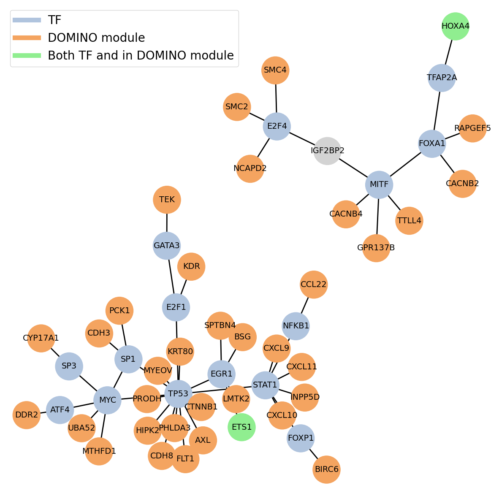

# Transcriptional Regulator Identification Using Prize-Collecting Steiner Trees (TRIPS)

TRIPS is a two-step workflow for identifying disease-associated candidate regulators that combines 1) an active module identification step on a protein-protein interaction (PPI) network and 2) transcriptional module identification by solving the prize-collecting Steiner tree (PCST) problem on a template gene regulatory network (GRN). The input to TRIPS are:

1) Differential expression analysis results. See folder 'data' for examples.
2) PPI network (a filtered BIOGRID network is provided as default).
3) Gene regulatory network (a filtered DOROTHEA is provided as default).

# Installation

Install conda environment as follows (there also exists a environment.yml but it contains more packages than necessary):
```bash
conda create --name trips_env python=3.8
conda activate trips_env
conda install  --channel conda-forge numpy pandas networkx matplotlib pip
pip install mygene
```

## Install DOMINO
Next, follow instructions for installing DOMINO here: https://github.com/Shamir-Lab/DOMINO. Please pay attention if pcst-fast package was succesfully installed, which normally is the case for Python3.7 or lower. Otherwise install it with python setup.py install from here https://github.com/fraenkel-lab/pcst_fast.

## Install DAPCSTP
Finally, follow the instructions for installation here: https://github.com/mluipersbeck/dapcstp.

# Running TRIPS
You can run TRIPS by calling
```bash
python run_trips.py file_ppi file_grn file_degs path_domino path_dapcstp output_folder 1.0 50
```
The positional arguments are:
```
[1] Path to PPI network file. Should be a tab-separated file with two columns: "node1" and "node2".
[2] Path to gene regulatory network file. Should be a tab-separated file with two columns: "node1" and "node2".
[3] Path to the differential expression results. Should be a tab-separated file with columns "Gene_symbol", "Log_FoldChange", "AdjPValue".
[4] Path to DOMINO.
[5] Path to DAPCSTP.
[6] Path to output folder.
[7] The logFoldChange threshold.
[8] Percentile value to determine the edge cost.
```

# Demo

For the tutorial, the relevant jupyter notebook can be found in `notebooks` > `TRIPS_demo.ipynb`.

Import the necessary packages and modules.
```python
import networkx as nx
import random
import os
import matplotlib as mpl
import matplotlib.pyplot as plt
from IPython.display import Image, display
import sys
sys.path.insert(1, "/home/giga/trips")

from trips_module.domino import DominoRunner
from trips_module.dapcstp import DAPCSTP
from trips_module.assign_scores import *
from trips_module.utils import *
from run_trips import run_trips_one
from plotting import plot_grn_trips
```
Next, set the paths to `dapcstp` and `DOMINO`, and load the PPI network and GRN. 
```python
# Set the paths to DAPCSTP and DOMINO
path_to_dapcst = r"/home/giga/dapcstp/solver/"
path_to_domino = r"/home/giga/anaconda3/envs/trips_demo/bin"

# Load the PPI network 
file_ppi = r"/home/giga/trips/data/networks/biogrid_scored.txt"
G_ppi = get_ppi_net(file_ppi)
print("No. of nodes of the PPI network: ", G_ppi.number_of_nodes())
print("No. of nodes of the PPI network: ", G_ppi.number_of_edges())

# Load the GRN
file_grn = r"/home/giga/trips/data/networks/dorothea_AB.txt"
G_grn = get_ppi_net(file_grn)
print("No. of nodes of the GRN: ", G_grn.number_of_nodes())
print("No. of nodes of the GRN: ", G_grn.number_of_edges())
```

Set the output folder and the csv file containing the differential expression analysis results.
```python
keyword = "dataset1"
main_output_folder = f"/home/giga/trips/results/{keyword}_results"
if not os.path.exists(main_output_folder):
    os.mkdir(main_output_folder)

file_degs = r"/home/giga/TRIPS_DEMO/trips/data/degs/GSE126848_signatureData.csv"
```

Finally, set the parameters and run TRIPS!
```python
# ------------Run TRIPS------------
lfc_thresh = 1.0
pval_thresh = 0.05

all_modules, G_all = run_trips_one(G_ppi, G_grn, file_degs,
                                   path_to_domino, path_to_dapcst,
                                   main_output_folder, keyword=keyword,
                                   lfc_thresh=lfc_thresh, pval_thresh=pval_thresh)
```

You can also generate a custom plot of the output TRIPS module using the plotting function provided.
```python
# Load the list of TFs for plotting
with open(r"/home/giga/trips/data/TF_names_v_1.01.txt", 'r') as f:
    all_tfs = [line.rstrip('\n') for line in f]
    
# Flatten the DOMINO output
domino_genes =  [x for xs in all_modules for x in xs]

# Set the node colors
tf_color = "lightsteelblue"
domino_color = "sandybrown"
both_color = "lightgreen"
nodesize = 2200
fontsize = 14

# Plot
file = r"/home/giga/TRIPS_DEMO/trips/results"
plot_grn_trips(G_all, all_tfs=all_tfs, domino_genes=domino_genes, figsize=(15, 15),
              legend_loc="upper left", tf_color=tf_color, domino_color=domino_color, both_color=both_color,
               nodesize=nodesize, fontsize=fontsize,
              filename=file)
```



# References
[1] Levi, H., Elkon, R., & Shamir, R. (2021). DOMINO: a network‐based active module identification algorithm with reduced rate of false calls. Molecular systems biology, 17(1), e9593. <br>
[2] Leitner, M., Ljubić, I., Luipersbeck, M., & Sinnl, M. (2018). A dual ascent-based branch-and-bound framework for the prize-collecting Steiner tree and related problems. INFORMS journal on computing, 30(2), 402-420.
